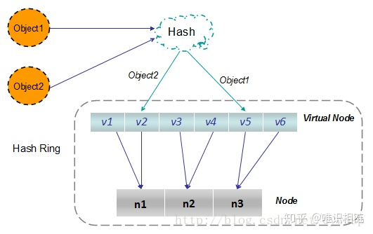

# Geecache
简单学习分布式缓存

该项目主要参考[https://geektutu.com/post/geecache-day7.html](https://geektutu.com/post/geecache-day7.html)
以空间换时间是软件工程中的一种经典思维，其中一个节点例子就是通过分配空间来缓存部分请求频率高的数据，达到加快请求响应效果。与此同时，引入一种方法通常同时会带来一些问题。`GeeCache`简单的说明了如何处理部分问题。
#### 项目概述
项目的基本逻辑如下，节点接收`key`，先查看本地缓存是否存在`value`，存在则返回不存在则向其他节点（一致性哈希）获取。其他节点存在则返回缓存值，否则调用回调函数（统一回调函数接口）来获取值并且加入缓存（`LRU`）。
```go
                         是
接收 key --> 检查是否被缓存 -----> 返回缓存值 ⑴
                |  否                         是
                |-----> 是否应当从远程节点获取 -----> 与远程节点交互 --> 返回缓存值 ⑵
                            |  否
                            |-----> 调用`回调函数`，获取值并添加到缓存 --> 返回缓存值 ⑶
```
#### 缓存淘汰
一定空间内添加缓存，一定会需要淘汰策略。这里使用`LRU`，基本思想是维护一个双链表，表头是最新节点，表尾是最旧节点，头部插入新访问节点、尾部删除旧节点。
[https://leetcode.cn/problems/lru-cache/](https://leetcode.cn/problems/lru-cache/)
#### 统一的回调函数
先考虑单机并发访问的情况，这时候需要`sync.Mutex`互斥锁来实现[参考](http://c.biancheng.net/view/107.html)。即在对存储的`k/v`操作时，需要加锁。
如果缓存未命中，需要执行相印的回调函数。
```go
// A Getter loads data for a key.
type Getter interface {
	Get(key string) ([]byte, error)
}

// A GetterFunc implements Getter with a function.
type GetterFunc func(key string) ([]byte, error)

// Get implements Getter interface function
func (f GetterFunc) Get(key string) ([]byte, error) {
	return f(key)
}
```
这里使用接口的实现，起到了如下效果，即只要**回调函数**的签名符合`func(key string) ([]byte, error)`，那么可以转换类型为`GetterFunc`，而`GetterFunc`的`Get`方法实现了`Getter`。然后该**回调函数**就可以作为`Getter`接口类型使用`Get`方法。
```go
func TestGetter(t *testing.T) {
	var f Getter = GetterFunc(func(key string) ([]byte, error) {
		return []byte(key), nil
	})

	expect := []byte("key")
	if v, _ := f.Get("key"); !reflect.DeepEqual(v, expect) {
		t.Errorf("callback failed")
	}
}
```
这样的做法的好处是，可以传入匿名函数，而不用专门创建`struct`来实现接口。
#### 一致性哈希
直接使用哈希映射不利于扩展，当映射的`key`范围发生变化，则大多数映射关系受到影响需要重新计算。
一致性哈希建立多个节点（尽可能均匀映射到环上），将固定的映射关系（映射到`0~2^31`的哈希环）以某种规则（顺时针查找距离最近的节点）存储到节点中。这样添加和删除节点都只会影响局部映射。[参考](https://zhuanlan.zhihu.com/p/129049724)
```go
func New(replicas int, fn Hash) *Map {
	m := &Map{
		replicas: replicas,
		hash:     fn,
		hashMap:  make(map[int]string),
	}
    //新建节点的hash分配
	if m.hash == nil {
		m.hash = crc32.ChecksumIEEE
	}
	return m
}
```
可能由于映射的不均匀导致存储节点的存储不均匀，可以将存储节点再次映射，比如`p1`位置的存储节点`A`映射为`p11`、`p12`、`p13`三个节点，顺时针最近到该三个坐标的映射都存储到`A`中。

添加节点：`keys`是包含虚节点的所有节点，`hashMap`是虚拟节点到真实节点的映射。可以看到在`Add`的过程中，每个`key`构造出了`replicas`个虚拟节点，`hashMap`可知他们都映射到`key`。
```go
// Add adds some keys to the hash.
func (m *Map) Add(keys ...string) {
	for _, key := range keys {
		for i := 0; i < m.replicas; i++ {
			hash := int(m.hash([]byte(strconv.Itoa(i) + key)))
			m.keys = append(m.keys, hash)
			m.hashMap[hash] = key
		}
	}
	sort.Ints(m.keys)
}
```
节点查找：找的是存储的真实节点。先找到距离最近的虚拟节点`keys[idx]`，再`hashMap[keys[idx]]`映射到真实节点。

